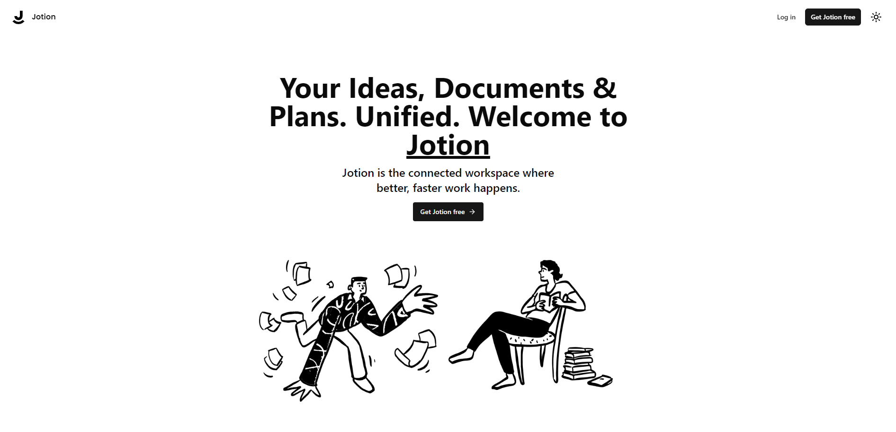

<h1 align="center">
  <picture>
    <source media="(prefers-color-scheme: dark)" srcset="public/icons/logo-dark.svg">
    
  </picture>

  <p>Jotion</h1>
</h1>

<div align="center">
  <p>Fullstack <a href="https://www.notion.so/" target="_blank">Notion</a> clone made by following the <a href="https://github.com/AntonioErdeljac/notion-clone-tutorial" target="_blank">tutorial</a>.</p>

  <div>
    <a href="https://www.typescriptlang.org/" target="_blank">
      
    </a>
    <a href="https://react.dev/" target="_blank">
      
    </a>
    <a href="https://tailwindcss.com/" target="_blank">
      
    </a>
    <a href="https://ui.shadcn.com/" target="_blank">
      
    </a>
  </div>
</div>

<br />

<div>
  <picture>
    <source media="(prefers-color-scheme: dark)" srcset="docs/home-page-dark.png">
    
  <picture>
</div>
  
## 🛠 Prerequisites
+ [Node](https://nodejs.org/en) version >= 18.x
+ [pnpm](https://pnpm.io/) package manager
+ Code editor ([Visual Studio Code](https://code.visualstudio.com/) recommended)

## 🔰 Getting started

### Clone the repository
The easiest way to get started is to scaffoled a copy of the repository by using [degit](https://github.com/Rich-Harris/degit).

```bash
pnpm dlx degit https://github.com/DorijanH/notion-clone notion-clone
```

### Installing dependencies
Installing dependencies is done by running the following command

```bash
pnpm i
```

### Environmental variables
Create a local configuration file `.env.local` using the `.env.local.example` template

### Running the application
In order for the application to work, both the backend and frontend need to be running in their own terminals:

#### Running the Convex backend
```bash
pnpm dlx convex dev
```

#### Running the frontend app
```bash
pnpm dev
```
